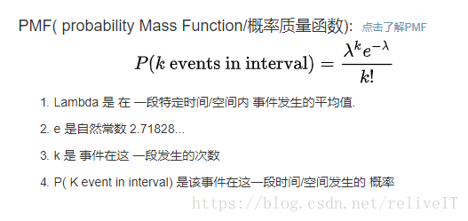
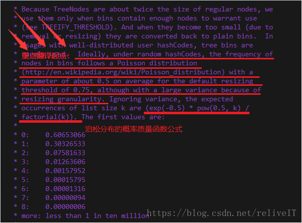
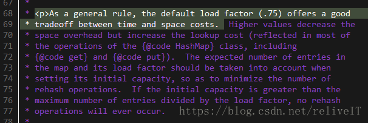
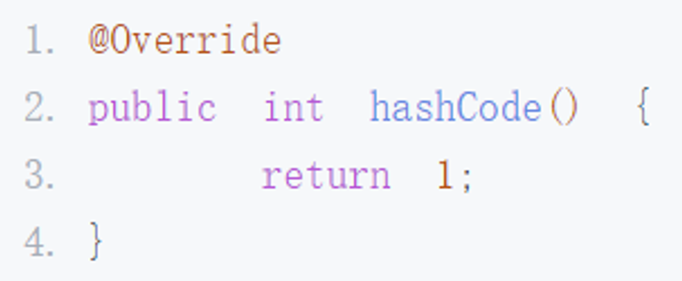

# HashMap defaultLoadFactor = 0.75和泊松分布没有关系


很多人说**HashMap的DEFAULT_LOAD_FACTOR = 0.75f是因为这样做满足泊松分布，这就是典型的半知半解、误人子弟、以其昏昏使人昭昭。实际上设置默认load factor为0.75和泊松分布没有关系，随机哈希的存放数据方式本身就是满足泊松分布的**。

java8及以上版本中开头这一段的注释，是为了解释在java8 HashMap中引入Tree Bin（也就是放数据的每个数组bin从链表node转换为red-black tree node）的原因。

 

## 一、二项分布

二项分布就是重复n次独立的伯努利试验。在每次试验中只有两种可能的结果，而且两种结果发生与否互相对立，并且相互独立，与其它各次试验结果无关，事件发生与否的概率p在每一次独立试验中都保持不变，则这一系列试验总称为n重伯努利实验，当试验次数为1时，二项分布服从0-1分布。

两个重点：

- 每次试验独立：第n次试验不受n-1次试验的影响，也不影响n+1次试验；

- 结果有且只有两个，并且互相对立：要么成功，要么失败，成功的概率+失败的概率=1；

至于二项分布图的绘制，也就是做n次试验，期望成功k次的概率分布。根据二项分布函数，你只需要知道试验总次数n、期望成功的次数k，以及每次试验成功的概率p，即可很快的求出成功k次的概率。

 

## 二、泊松分布

泊松分布： 是离散随机分布的一种，通常被使用在估算在 一段特定时间/空间内发生成功事件的数量的概率。

泊松分布是二项分布p趋近于零、n趋近于无穷大的极限形式，泊松分布的概率质量函数如下图。



 

这个概率质量函数在HashMap的注释中也出现了。

 

 

## 三、注释中load factor和泊松分布的关系

接第二部分HashMap中的注释截图。其中也给出了泊松分布的概率质量函数公式，除此之外还要重点关注划线的需要翻译的部分。注释原文如下。

```markdown
Ideally, under random hashCodes, the frequency of nodes in bins follows a Poisson distribution(http://en.wikipedia.org/wiki/Poisson_distribution) with a parameter of about 0.5 on average for the default resizing threshold of 0.75, although with a large variance because of resizing granularity.
```


该部分注释的翻译如下。

```markdown
在理想的随机hashCodes下，容器中节点的频率遵循泊松分布（http://en.wikipedia.org/wiki/Poisson_.），对于0.75的默认调整阈值，泊松分布的概率质量函数中参数λ（事件发生的平均次数）的值约为0.5，尽管λ的值会因为load factor值的调整而产生较大变化。
```


所以，这一段注释（甚至是HashMap开头的这一大段注释都和load factor无关）不是说设置load factor为0.75的原因，而是说在默认调整阈值为0.75的情况下，泊松分布概率质量函数中的参数λ=0.5，注释中随后给出的泊松分布PMF公式： (exp(-0.5) * pow(0.5, k)/factorial(k))，其中0.5指代λ的值。再次对照泊松分布的质量概率函数PMF公示如下。


这一段乃至HashMap开头的一大段注释都没有解释load factory默认值是0.75的原因，而是说load factor的值会影响泊松分布PMF函数公式中的参数λ的值，例如load factor=0.75f时λ=0.5。按照泊松分布公式来看，期望放入bin中数据的数量k=8，e是一个无理常数，λ的值受load factor的值的影响（泊松分布是用来估算在 一段特定时间或空间内发生成功事件的数量的概率，即在长度为length的数组中hash放入0.75*length数量的数据，数组中某一个下标放入k个数据的概率）。

 


java8及以上版本的HashMap中这段注释的解释：

- 这一段注释的内容和目的都是为了解释在java8 HashMap中引入Tree Bin（也就是放入数据的每个数组bin从链表node转换为red-black tree node）的原因
- 原注释如上图划线部分：Because TreeNodes are about twice the size of regular nodes, we use them only when bins contain enough nodes to warrant use(see TREEIFY_THRESHOLD).
- **TreeNode虽然改善了链表增删改查的性能，但是其节点大小是链表节点的两倍**
- 虽然引入TreeNode但是不会轻易转变为TreeNode（如果存在大量转换那么资源代价比较大），根据泊松分布来看转变是小概率事件，性价比是值得的
- 泊松分布是二项分布的极限形式，两个重点：事件独立、有且只有两个相互对立的结果
- 泊松分布是指一段时间或空间中发生成功事件的数量的概率
- 对HashMap table[]中任意一个bin来说，存入一个数据，要么放入要么不放入，这个动作满足二项分布的两个重点概念
- 对于HashMap.table[].length的空间来说，放入0.75*length个数据，某一个bin中放入节点数量的概率情况如上图注释中给出的数据（表示数组某一个下标存放数据数量为0~8时的概率情况）
- 举个例子说明，HashMap默认的table[].length=16，在长度为16的HashMap中放入12（0.75*length）个数据，某一个bin中存放了8个节点的概率是0.00000006
- 扩容一次，16*2=32，在长度为32的HashMap中放入24个数据，某一个bin中存放了8个节点的概率是0.00000006
- 再扩容一次，32*2=64，在长度为64的HashMap中放入48个数据，某一个bin中存放了8个节点的概率是0.00000006

所以，当某一个bin的节点大于等于8个的时候，就可以从链表node转换为treenode，其性价比是值得的。

 

## 四、DEFAULT_LOAD_FACTOR =0.75f的真正原因

load factory=0.75的真正原因，在java7、8等中均有注释（这段注释在public class HashMap类定义之前，附注的注释即本文所讨论的注释是在HashMap类定义之后），如下图所示，**负载因子太小了浪费空间并且会发生更多次数的resize，太大了哈希冲突增加会导致性能不好，所以0.75只是一个折中的选择，和泊松分布没有什么关系**。



 

五、其他补充
1. 为什么default load factor=0.75，可以参看这篇博客：https://www.jianshu.com/p/64f6de3ffcc1

2. 泊松分布参考文章：http://episte.math.ntu.edu.tw/articles/sm/sm_16_07_1/index.html

 

六、附录——代码注释原文

```markdown
Implementation notes.

 

This map usually acts as a binned (bucketed) hash table, but when bins get too large, they are transformed into bins of TreeNodes, each structured similarly to those in java.util.TreeMap. Most methods try to use normal bins, but relay to TreeNode methods when applicable (simply by checking instanceof a node). Bins of TreeNodes may be traversed and used like any others, but additionally support faster lookup when overpopulated. However, since the vast majority of bins in normal use are not overpopulated, checking for existence of tree bins may be delayed in the course of table methods.

 

Tree bins (i.e., bins whose elements are all TreeNodes) are ordered primarily by hashCode, but in the case of ties, if two elements are of the same "class C implements Comparable<C>", type then their compareTo method is used for ordering. (We conservatively check generic types via reflection to validate this -- see method comparableClassFor). The added complexity of tree bins is worthwhile in providing worst-case O(log n) operations when keys either have distinct hashes or are orderable, Thus, performance degrades gracefully under accidental or malicious usages in which hashCode() methods return values that are poorly distributed, as well as those in which many keys share a hashCode, so long as they are also Comparable. (If neither of these apply, we may waste about a factor of two in time and space compared to taking no precautions. But the only known cases stem from poor user programming practices that are already so slow that this makes little difference.)

 

Because TreeNodes are about twice the size of regular nodes, we use them only when bins contain enough nodes to warrant use(see TREEIFY_THRESHOLD). And when they become too small (due to removal or resizing) they are converted back to plain bins. In usages with well-distributed user hashCodes, tree bins are rarely used. Ideally, under random hashCodes, the frequency of nodes in bins follows a Poisson distribution(http://en.wikipedia.org/wiki/Poisson_distribution) with a parameter of about 0.5 on average for the default resizing threshold of 0.75, although with a large variance because of resizing granularity. Ignoring variance, the expected occurrences of list size k are (exp(-0.5) * pow(0.5, k)/factorial(k)). The first values are:

0: 0.60653066

1: 0.30326533

2: 0.07581633

3: 0.01263606

4: 0.00157952

5: 0.00015795

6: 0.00001316

7: 0.00000094

8: 0.00000006

more: less than 1 in ten million

 

The root of a tree bin is normally its first node. However, sometimes (currently only upon Iterator.remove), the root might be elsewhere, but can be recovered following parent links (method TreeNode.root()).

 

All applicable internal methods accept a hash code as an argument (as normally supplied from a public method), allowing them to call each other without recomputing user hashCodes. Most internal methods also accept a "tab" argument, that is normally the current table, but may be a new or old one when resizing or converting.

 

When bin lists are treeified, split, or untreeified, we keep them in the same relative access/traversal order (i.e., field Node.next) to better preserve locality, and to slightly simplify handling of splits and traversals that invoke iterator.remove. When using comparators on insertion, to keep a total ordering (or as close as is required here) across rebalancings, we compare classes and identityHashCodes as tie-breakers.

 

The use and transitions among plain vs tree modes is complicated by the existence of subclass LinkedHashMap. See below for hook methods defined to be invoked upon insertion, removal and access that allow LinkedHashMap internals to otherwise remain independent of these mechanics. (This also requires that a map instance be passed to some utility methods that may create new nodes.)

 

The concurrent-programming-like SSA-based coding style helps avoid aliasing errors amid all of the twisty pointer operations.

```


# 链表转红黑树的原因？为什么阈值为8？


在理想情况下，链表长度符合泊松分布，各个长度的命中概率依次递减，当长度为 8 的时候，概率仅为 0.00000006。这是一个小于千万分之一的概率，通常我们的 Map 里面是不会存储这么多的数据的，所以通常情况下，并不会发生从链表向红黑树的转换。

但是，HashMap 决定某一个元素落到哪一个桶里，是和这个对象的 hashCode 有关的，JDK 并不能阻止我们用户实现自己的哈希算法，如果我们故意把哈希算法变得不均匀，例如：



事实上，**链表长度超过 8 就转为红黑树的设计，更多的是为了防止用户自己实现了不好的哈希算法时导致链表过长，从而导致查询效率低，而此时转为红黑树更多的是一种保底策略，用来保证极端情况下查询的效率**。

通常如果 hash 算法正常的话，那么链表的长度也不会很长，那么红黑树也不会带来明显的查询时间上的优势，反而会增加空间负担。所以通常情况下，并没有必要转为红黑树，所以就选择了概率非常小，小于千万分之一概率，也就是长度为 8 的概率，把长度 8 作为转化的默认阈值。

所以如果平时开发中发现 HashMap 或是 ConcurrentHashMap 内部出现了红黑树的结构，这个时候往往就说明我们的哈希算法出了问题，需要留意是不是我们实现了效果不好的 hashCode 方法，并对此进行改进，以便减少冲突。


# 为什么退化为链表的阈值是6？


1.TreeNodes占用空间是普通Nodes的两倍，为了空间和时间的权衡，为6时红黑树也比链表快，但转换过程消耗和空间消耗不划算

2.节点的分布频率会遵循泊松分布，链表长度达到8个元素的概率为0.00000006，几乎是不可能事件

3.提出来回转化的阈值8和6阈值为什么不一样

至于为什么转化为红黑树的阈值8和转化为链表的阈值6不一样，是为了**避免频繁来回转化**