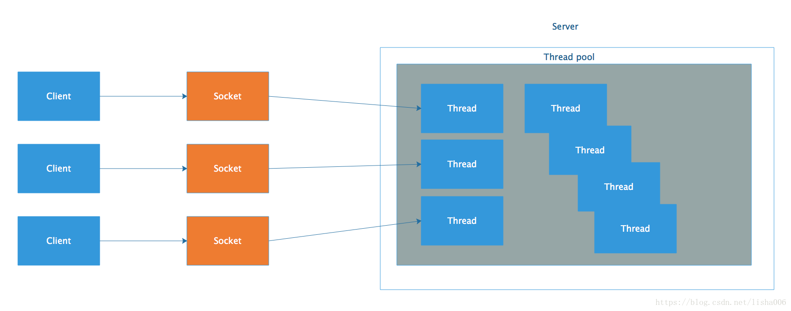
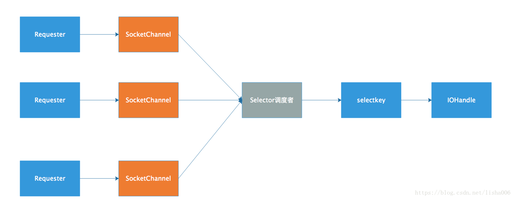
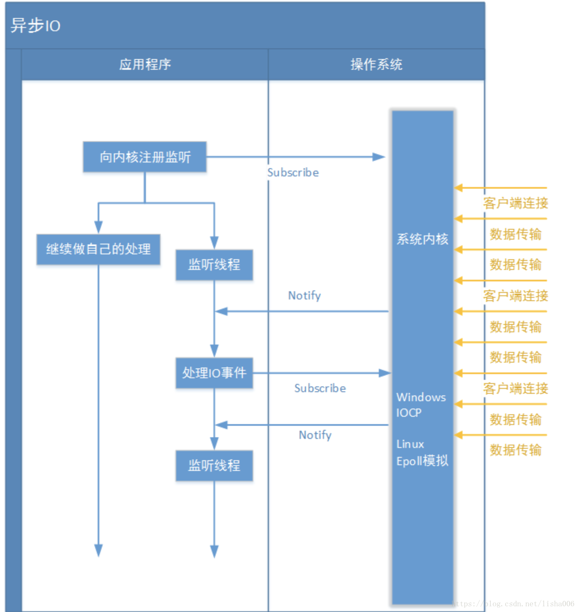
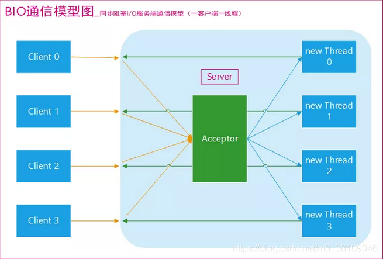
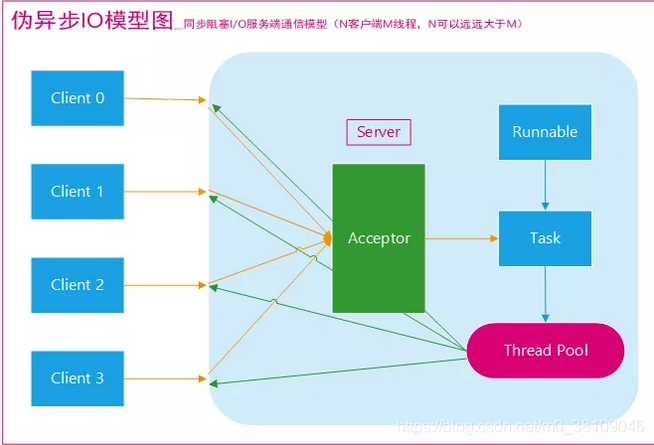
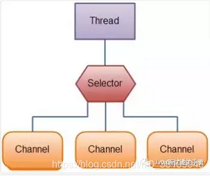
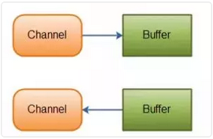

简单回顾
对于IO我们应该非常熟悉了，IO不仅仅针对文件的操作，网络编程socket的通信，就是IO操作。

输入、输出流（InputStream、OutputStream）用于读取或写入字节，如操作图片、视频等。

Reader和Writer 则用于操作字符，增加了字符编码功能。本质上计算机操作都是字节，不管是网络或者文件，Reader和Writer等于构建了应用逻辑和原始数据的另一层通道。

BufferedOutputStream、BufferedInputStream等带有缓冲区的实现，可以避免频繁的磁盘操作，通过设计缓冲区将批量数据进行一次操作。

NIO
 能解决什么问题？

      为什么要有NIO，NIO是什么？

首先看一下BIO，如果有一台服务器，能承受简单的客户端请求，那么使用io和net中的同步、阻塞式API应该是可以实现了。但是为了一个用户的请求而单独启动一个线程，开销应该不小吧。java语言对线程的实现是比较重量的，启动或销毁线程，都会有明显开销，每个线程都有单独的线程棧占用明显的内存。引入线程池，就能很大程度的避免不必要的开销。



这种情况适合连接数并不多，只有最多几百个连接的普通应用，能比较好的进行工作，但如果连接数量剧增，这种实现方式就无法很好的工作了，对于并发量要求较高的企业，这种方案，肯定是不可取的。

NIO采用的是一种多路复用的机制，利用单线程轮询事件，高效定位就绪的Channel来决定做什么，只是Select阶段是阻塞式的，能有效避免大量连接数时，频繁线程的切换带来的性能或各种问题。



 

上图随便画的，只是方便理解，并不能作为实现的具体的参考。

首先，Requester方通过Selector.open()创建了一个Selector准备好了调度角色。

创建了SocketChannel(ServerSocketChannel) 并注册到Selector中，通过设置key（SelectionKey）告诉调度者所应该关注的连接请求。

阻塞，Selector阻塞在select操作中，如果发现有Channel发生连接请求，就会唤醒处理请求。

NIO同步非阻塞式IO

      对比BIO的同步阻塞IO操作，实际上NIO是同步非阻塞IO，一个线程在同步的进行轮询检查，Selector不断轮询注册在其上的Channel，某个Channel上面发生读写连接请求，这个Channel就处于就绪状态，被Selector轮询出来，然后通过SelectionKey可以获取就绪Channel的集合，进行后续的I/O操作。
    
       同步和异步说的是消息的通知机制，这个线程仍然要定时的读取stream，判断数据有没有准备好，client采用循环的方式去读取（线程自己去抓去信息），CPU被浪费。
    
     非阻塞：体现在，这个线程可以去干别的，不需要一直在这等着。Selector可以同时轮询多个Channel，因为JDK使用了epoll()代替传统的select实现，没有最大连接句柄限制。所以只需要一个线程负责Selector的轮询，就可以接入成千上万的客户端。

AIO
是在NIO的基础上引入异步通道的概念，实现异步非阻塞式的IO处理。如下图（网络截图）：



        AIO不需要通过多路复用器对注册的通道进行轮询操作即可实现异步读写。什么意思呢？NIO采用轮询的方式，一直在轮询的询问stream中数据是否准备就绪，如果准备就绪发起处理。但是AIO就不需要了，AIO框架在windows下使用windows IOCP技术，在Linux下使用epoll多路复用IO技术模拟异步IO， 即：应用程序向操作系统注册IO监听，然后继续做自己的事情。操作系统发生IO事件，并且准备好数据后，在主动通知应用程序，触发相应的函数（这就是一种以订阅者模式进行的改造）。由于应用程序不是“轮询”方式而是订阅-通知方式，所以不再需要selector轮询，由channel通道直接到操作系统注册监听。

NIO（AIO）中几个概念
缓冲区 Buffer

 

NIO基于块进行数据处理，在NIO中所有数据的读取都是通过缓冲Buffer进行处理。

     具体的缓存区有这些：ByteBuffe、CharBuffer、 ShortBuffer、IntBuffer、LongBuffer、FloatBuffer、DoubleBuffer。他们实现了相同的接口：Buffer。

通道 Channel

     对数据的读取和写入要通过Channel通道。通道不同于流的地方就是通道是双向的，用于读、写和同时读写操作。底层的操作系统的通道一般都是全双工的，全双工的Channel比流能更好的映射底层操作系统的API。

多路复用器 Selector

Selector提供选择已经就绪的任务的能力：

      Selector轮询注册在其上的Channel，如果某个Channel发生读写请求并且Channel就处于就绪状态，会被Selector轮询出来，然后通过SelectionKey可以获取就绪Channel的集合，进行后续的I/O操作。（同步）
    
      一个Selector可以同时轮询多个Channel，因为JDK使用了epoll()代替传统的select实现，所以没有最大连接句柄1024/2048的限制。所以，只需要一个线程负责Selector的轮询，就可以接入成千上万的客户端。（非阻塞）

NIO和AIO
NIO：会等数据准备好后，再交由应用进行处理，数据的读取/写入过程依然在应用线程中完成，只是将等待的时间剥离到单独的线程中去，节省了数据准备时间，因为多路复用机制，Selector会得到复用，对于那些读写过程时间长的，NIO就不太适合。

AIO：读完（内核内存拷贝到用户内存）了系统再通知应用，使用回调函数，进行业务处理，AIO能够胜任那些重量级，读写过程长的任务。


**目录：**

- \1. BIO (Blocking I/O)
  - 1.1 传统 BIO
  - 1.2 伪异步 IO
  - 1.3 代码示例
  - 1.4 总结
- \2. NIO (New I/O)
  - 2.1 NIO 简介
  - 2.2 NIO的特性/NIO与IO区别
    - 1)Non-blocking IO（非阻塞IO）
    - 2)Buffer(缓冲区)
    - 3)Channel (通道)
    - 4)Selectors(选择器)
  - 2.3 NIO 读数据和写数据方式
  - 2.4 NIO核心组件简单介绍
  - 2.5 代码示例
- \3. AIO (Asynchronous I/O)
- 参考

# BIO,NIO,AIO 总结

Java 中的 BIO、NIO和 AIO 理解为是 Java 语言对操作系统的各种 IO 模型的封装。程序员在使用这些 API 的时候，不需要关心操作系统层面的知识，也不需要根据不同操作系统编写不同的代码。只需要使用Java的API就可以了。

在讲 BIO,NIO,AIO 之前先来回顾一下这样几个概念：同步与异步，阻塞与非阻塞。

**同步与异步**

- **同步：** 同步就是发起一个调用后，被调用者未处理完请求之前，调用不返回。
- **异步：** 异步就是发起一个调用后，立刻得到被调用者的回应表示已接收到请求，但是被调用者并没有返回结果，此时我们可以处理其他的请求，被调用者通常依靠事件，回调等机制来通知调用者其返回结果。

同步和异步的区别最大在于异步的话调用者不需要等待处理结果，被调用者会通过回调等机制来通知调用者其返回结果。

**阻塞和非阻塞**

- **阻塞：** 阻塞就是发起一个请求，调用者一直等待请求结果返回，也就是当前线程会被挂起，无法从事其他任务，只有当条件就绪才能继续。
- **非阻塞：** 非阻塞就是发起一个请求，调用者不用一直等着结果返回，可以先去干其他事情。

**那么同步阻塞、同步非阻塞和异步非阻塞又代表什么意思呢？**

举个生活中简单的例子，你妈妈让你烧水，小时候你比较笨啊，在哪里傻等着水开（**同步阻塞**）。等你稍微再长大一点，你知道每次烧水的空隙可以去干点其他事，然后只需要时不时来看看水开了没有（**同步非阻塞**）。后来，你们家用上了水开了会发出声音的壶，这样你就只需要听到响声后就知道水开了，在这期间你可以随便干自己的事情，你需要去倒水了（**异步非阻塞**）。

## 1. BIO (Blocking I/O)

同步阻塞I/O模式，数据的读取写入必须阻塞在一个线程内等待其完成。


### 1.1 传统 BIO

BIO通信（一请求一应答）模型图如下(图源网络，原出处不明)：



采用 **BIO 通信模型** 的服务端，通常由一个独立的 Acceptor 线程负责监听客户端的连接。我们一般通过在 `while(true)` 循环中服务端会调用 `accept()` 方法等待接收客户端的连接的方式监听请求，请求一旦接收到一个连接请求，就可以建立通信套接字在这个通信套接字上进行读写操作，此时不能再接收其他客户端连接请求，只能等待同当前连接的客户端的操作执行完成， 不过可以通过多线程来支持多个客户端的连接，如上图所示。

如果要让 **BIO 通信模型** 能够同时处理多个客户端请求，就必须使用多线程（主要原因是 `socket.accept()`、 `socket.read()`、 `socket.write()` 涉及的三个主要函数都是同步阻塞的），也就是说它在接收到客户端连接请求之后为每个客户端创建一个新的线程进行链路处理，处理完成之后，通过输出流返回应答给客户端，线程销毁。这就是典型的 **一请求一应答通信模型** 。我们可以设想一下如果这个连接不做任何事情的话就会造成不必要的线程开销，不过可以通过 **线程池机制** 改善，线程池还可以让线程的创建和回收成本相对较低。使用`FixedThreadPool` 可以有效的控制了线程的最大数量，保证了系统有限的资源的控制，实现了N(客户端请求数量):M(处理客户端请求的线程数量)的伪异步I/O模型（N 可以远远大于 M），下面一节"伪异步 BIO"中会详细介绍到。

**我们再设想一下当客户端并发访问量增加后这种模型会出现什么问题？**

在 Java 虚拟机中，线程是宝贵的资源，线程的创建和销毁成本很高，除此之外，线程的切换成本也是很高的。尤其在 Linux 这样的操作系统中，线程本质上就是一个进程，创建和销毁线程都是重量级的系统函数。如果并发访问量增加会导致线程数急剧膨胀可能会导致线程堆栈溢出、创建新线程失败等问题，最终导致进程宕机或者僵死，不能对外提供服务。

### 1.2 伪异步 IO

为了解决同步阻塞I/O面临的一个链路需要一个线程处理的问题，后来有人对它的线程模型进行了优化一一一后端通过一个线程池来处理多个客户端的请求接入，形成客户端个数M：线程池最大线程数N的比例关系，其中M可以远远大于N.通过线程池可以灵活地调配线程资源，设置线程的最大值，防止由于海量并发接入导致线程耗尽。

伪异步IO模型图(图源网络，原出处不明)：



采用线程池和任务队列可以实现一种叫做伪异步的 I/O 通信框架，它的模型图如上图所示。当有新的客户端接入时，将客户端的 Socket 封装成一个Task（该任务实现java.lang.Runnable接口）投递到后端的线程池中进行处理，JDK 的线程池维护一个消息队列和 N 个活跃线程，对消息队列中的任务进行处理。由于线程池可以设置消息队列的大小和最大线程数，因此，它的资源占用是可控的，无论多少个客户端并发访问，都不会导致资源的耗尽和宕机。

伪异步I/O通信框架采用了线程池实现，因此避免了为每个请求都创建一个独立线程造成的线程资源耗尽问题。不过因为它的底层任然是同步阻塞的BIO模型，因此无法从根本上解决问题。

### 1.3 代码示例

下面代码中演示了BIO通信（一请求一应答）模型。我们会在客户端创建多个线程依次连接服务端并向其发送"当前时间+:hello world"，服务端会为每个客户端线程创建一个线程来处理。代码示例出自闪电侠的博客，原地址如下：

https://www.jianshu.com/p/a4e03835921a

**客户端**

```java

public class IOClient {

   public static void main(String[] args) {

       // TODO 创建多个线程，模拟多个客户端连接服务端
       new Thread(() -> {
           try {
               Socket socket = new Socket("127.0.0.1", 3333);
               while (true) {
                   try {
                       socket.getOutputStream().write((new Date() + ": hello world").getBytes());
                       Thread.sleep(2000);
                   } catch (Exception e) {
                   }
               }
           } catch (IOException e) {
           }
       }).start();
   }

}
```

**服务端**

```java

public class IOServer {

   public static void main(String[] args) throws IOException {

       // TODO 服务端处理客户端连接请求
       ServerSocket serverSocket = new ServerSocket(3333);
       // 接收到客户端连接请求之后为每个客户端创建一个新的线程进行链路处理
       new Thread(() -> {
           while (true) {
               try {
                   // 阻塞方法获取新的连接
                   Socket socket = serverSocket.accept();
                   // 每一个新的连接都创建一个线程，负责读取数据
                   new Thread(() -> {
                       try {
                           int len;
                           byte[] data = new byte[1024];
                           InputStream inputStream = socket.getInputStream();
                           // 按字节流方式读取数据
                           while ((len = inputStream.read(data)) != -1) {
                               System.out.println(new String(data, 0, len));
                           }
                       } catch (IOException e) {
                       }
                   }).start();
               } catch (IOException e) {
               }

           }
       }).start();

   }

}
```

### 1.4 总结

在活动连接数不是特别高（小于单机1000）的情况下，这种模型是比较不错的，可以让每一个连接专注于自己的 I/O 并且编程模型简单，也不用过多考虑系统的过载、限流等问题。线程池本身就是一个天然的漏斗，可以缓冲一些系统处理不了的连接或请求。但是，当面对十万甚至百万级连接的时候，传统的 BIO 模型是无能为力的。因此，我们需要一种更高效的 I/O 处理模型来应对更高的并发量。

## 2. NIO (New I/O)


### 2.1 NIO 简介

NIO是一种同步非阻塞的I/O模型，在Java 1.4 中引入了NIO框架，对应 java.nio 包，提供了 Channel , Selector，Buffer等抽象。

NIO中的N可以理解为Non-blocking，不单纯是New。它支持面向缓冲的，基于通道的I/O操作方法。 NIO提供了与传统BIO模型中的 `Socket` 和 `ServerSocket` 相对应的 `SocketChannel` 和 `ServerSocketChannel` 两种不同的套接字通道实现,两种通道都支持阻塞和非阻塞两种模式。阻塞模式使用就像传统中的支持一样，比较简单，但是性能和可靠性都不好；非阻塞模式正好与之相反。对于低负载、低并发的应用程序，可以使用同步阻塞I/O来提升开发速率和更好的维护性；对于高负载、高并发的（网络）应用，应使用 NIO 的非阻塞模式来开发。

### 2.2 NIO的特性/NIO与IO区别

如果是在面试中回答这个问题，我觉得首先肯定要从 NIO 流是非阻塞 IO 而 IO 流是阻塞 IO 说起。然后，可以从 NIO 的3个核心组件/特性为 NIO 带来的一些改进来分析。如果，你把这些都回答上了我觉得你对于 NIO 就有了更为深入一点的认识，面试官问到你这个问题，你也能很轻松的回答上来了。

1)Non-blocking IO（非阻塞IO）

**IO流是阻塞的，NIO流是不阻塞的。**

Java NIO使我们可以进行非阻塞IO操作。比如说，单线程中从通道读取数据到buffer，同时可以继续做别的事情，当数据读取到buffer中后，线程再继续处理数据。写数据也是一样的。另外，非阻塞写也是如此。一个线程请求写入一些数据到某通道，但不需要等待它完全写入，这个线程同时可以去做别的事情。

Java IO的各种流是阻塞的。这意味着，当一个线程调用 `read()` 或 `write()` 时，该线程被阻塞，直到有一些数据被读取，或数据完全写入。该线程在此期间不能再干任何事情了

2)Buffer(缓冲区)

**IO 面向流(Stream oriented)，而 NIO 面向缓冲区(Buffer oriented)。**

Buffer是一个对象，它包含一些要写入或者要读出的数据。在NIO类库中加入Buffer对象，体现了新库与原I/O的一个重要区别。在面向流的I/O中·可以将数据直接写入或者将数据直接读到 Stream 对象中。虽然 Stream 中也有 Buffer 开头的扩展类，但只是流的包装类，还是从流读到缓冲区，而 NIO 却是直接读到 Buffer 中进行操作。

在NIO厍中，所有数据都是用缓冲区处理的。在读取数据时，它是直接读到缓冲区中的; 在写入数据时，写入到缓冲区中。任何时候访问NIO中的数据，都是通过缓冲区进行操作。

最常用的缓冲区是 ByteBuffer,一个 ByteBuffer 提供了一组功能用于操作 byte 数组。除了ByteBuffer,还有其他的一些缓冲区，事实上，每一种Java基本类型（除了Boolean类型）都对应有一种缓冲区。

3)Channel (通道)

NIO 通过Channel（通道） 进行读写。

通道是双向的，可读也可写，而流的读写是单向的。无论读写，通道只能和Buffer交互。因为 Buffer，通道可以异步地读写。

4)Selectors(选择器)

NIO有选择器，而IO没有。

选择器用于使用单个线程处理多个通道。因此，它需要较少的线程来处理这些通道。线程之间的切换对于操作系统来说是昂贵的。 因此，为了提高系统效率选择器是有用的。



### 2.3 NIO 读数据和写数据方式

通常来说NIO中的所有IO都是从 Channel（通道） 开始的。

- 从通道进行数据读取 ：创建一个缓冲区，然后请求通道读取数据。
- 从通道进行数据写入 ：创建一个缓冲区，填充数据，并要求通道写入数据。

数据读取和写入操作图示：



### 2.4 NIO核心组件简单介绍

NIO 包含下面几个核心的组件：

- Channel(通道)
- Buffer(缓冲区)
- Selector(选择器)

整个NIO体系包含的类远远不止这三个，只能说这三个是NIO体系的“核心API”。我们上面已经对这三个概念进行了基本的阐述，这里就不多做解释了。

### 2.5 代码示例

代码示例出自闪电侠的博客，原地址如下：

https://www.jianshu.com/p/a4e03835921a

客户端 IOClient.java 的代码不变，我们对服务端使用 NIO 进行改造。以下代码较多而且逻辑比较复杂，大家看看就好。

```java

public class NIOServer {

   public static void main(String[] args) throws IOException {

       // 1. serverSelector负责轮询是否有新的连接，服务端监测到新的连接之后，不再创建一个新的线程，
       // 而是直接将新连接绑定到clientSelector上，这样就不用 IO 模型中 1w 个 while 循环在死等
       Selector serverSelector = Selector.open();

       // 2. clientSelector负责轮询连接是否有数据可读
       Selector clientSelector = Selector.open();

       new Thread(() -> {
           try {
               // 对应IO编程中服务端启动
               ServerSocketChannel listenerChannel = ServerSocketChannel.open();
               listenerChannel.socket().bind(new InetSocketAddress(3333));
               listenerChannel.configureBlocking(false);
               listenerChannel.register(serverSelector, SelectionKey.OP_ACCEPT);
               while (true) {
                   // 监测是否有新的连接，这里的1指的是阻塞的时间为 1ms
                   if (serverSelector.select(1) > 0) {
                       Set<SelectionKey> set = serverSelector.selectedKeys();
                       Iterator<SelectionKey> keyIterator = set.iterator();
                       while (keyIterator.hasNext()) {
                           SelectionKey key = keyIterator.next();
                           if (key.isAcceptable()) {
                               try {
                                   // (1)
                                   // 每来一个新连接，不需要创建一个线程，而是直接注册到clientSelector
                                   SocketChannel clientChannel = ((ServerSocketChannel) key.channel()).accept();

                                   clientChannel.configureBlocking(false);
                                   clientChannel.register(clientSelector, SelectionKey.OP_READ);

                               } finally {

                                   keyIterator.remove();

                               }
                           }
                       }

                   }

               }

           } catch (IOException ignored) {

           }

       }).start();

       new Thread(() -> {

           try {
               while (true) {
                   // (2) 批量轮询是否有哪些连接有数据可读，这里的1指的是阻塞的时间为 1ms
                   if (clientSelector.select(1) > 0) {
                       Set<SelectionKey> set = clientSelector.selectedKeys();
                       Iterator<SelectionKey> keyIterator = set.iterator();
                       while (keyIterator.hasNext()) {
                           SelectionKey key = keyIterator.next();
                           if (key.isReadable()) {
                               try {
                                   SocketChannel clientChannel = (SocketChannel) key.channel();
                                   ByteBuffer byteBuffer = ByteBuffer.allocate(1024);
                                   // (3) 面向 Buffer
                                   clientChannel.read(byteBuffer);
                                   byteBuffer.flip();
                                   System.out.println(
  Charset.defaultCharset().newDecoder().decode(byteBuffer).toString());
                               } finally {
                                   keyIterator.remove();
                                   key.interestOps(SelectionKey.OP_READ);
                               }
                           }
                       }
                   }
               }
           } catch (IOException ignored) {
           }

       }).start();

   }

}
```

为什么大家都不愿意用 JDK 原生 NIO 进行开发呢？从上面的代码中大家都可以看出来，是真的难用！除了编程复杂、编程模型难之外，它还有以下让人诟病的问题：

- JDK 的 NIO 底层由 epoll 实现，该实现饱受诟病的空轮询 bug 会导致 cpu 飙升 100%
- 项目庞大之后，自行实现的 NIO 很容易出现各类 bug，维护成本较高，上面这一坨代码我都不能保证没有 bug

Netty 的出现很大程度上改善了 JDK 原生 NIO 所存在的一些让人难以忍受的问题。

## 3. AIO (Asynchronous I/O)

AIO 也就是 NIO 2。在 Java 7 中引入了 NIO 的改进版 NIO 2,它是异步非阻塞的IO模型。异步 IO 是基于事件和回调机制实现的，也就是应用操作之后会直接返回，不会堵塞在那里，当后台处理完成，操作系统会通知相应的线程进行后续的操作。

AIO 是异步IO的缩写，虽然 NIO 在网络操作中，提供了非阻塞的方法，但是 NIO 的 IO 行为还是同步的。对于 NIO 来说，我们的业务线程是在 IO 操作准备好时，得到通知，接着就由这个线程自行进行 IO 操作，IO操作本身是同步的。（除了 AIO 其他的 IO 类型都是同步的，这一点可以从底层IO线程模型解释，推荐一篇文章：[《漫话：如何给女朋友解释什么是Linux的五种IO模型？》](https://mp.weixin.qq.com/s?__biz=Mzg3MjA4MTExMw==&mid=2247484746&idx=1&sn=c0a7f9129d780786cabfcac0a8aa6bb7&source=41&scene=21#wechat_redirect) ）

查阅网上相关资料，我发现就目前来说 AIO 的应用还不是很广泛，Netty 之前也尝试使用过 AIO，不过又放弃了。