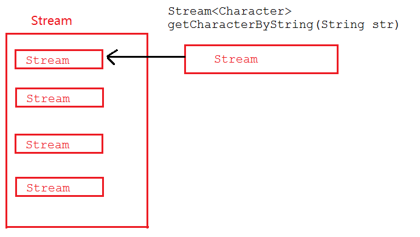
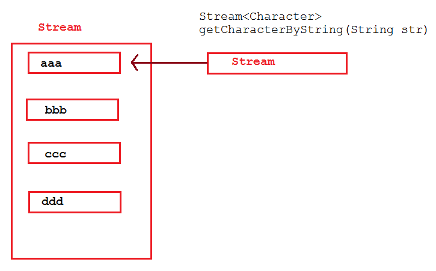

# Java8新特性之：Stream API


Java8的两个重大改变，一个是Lambda表达式，另一个就是本节要讲的Stream API表达式。Stream 是Java8中处理集合的关键抽象概念，它可以对集合进行非常复杂的查找、过滤、筛选等操作，在新版的JPA中，也已经加入了Stream。如：

```
@Query("select u from User u")
Stream<User> findAllByCustomQueryAndStream();

Stream<User> readAllByFirstnameNotNull();

@Query("select u from User u")
Stream<User> streamAllPaged(Pageable pageable);
```


Stream API给我们操作集合带来了强大的功用，同时Stream API操作简单，容易上手。

## 1、Stream的操作步骤

Stream有如下三个操作步骤：

**一、创建Stream**

从一个数据源，如集合、数组中获取流。

**二、中间操作**

一个操作的中间链，对数据源的数据进行操作。

**三、终止操作**

一个终止操作，执行中间操作链，并产生结果。

要注意的是，对流的操作完成后需要进行关闭操作（或者用JAVA7的try-with-resources）。

举个简单的例子：

假设有一个Person类和一个Person列表，现在有两个需求：1）找到年龄大于18岁的人并输出；2）找出所有中国人的数量。


```java
@Data
class Person {
    private String name;
    private Integer age;
    private String country;
    private char sex;

    public Person(String name, Integer age, String country, char sex) {
        this.name = name;
        this.age = age;
        this.country = country;
        this.sex = sex;
    }
}
```


```java
List<Person> personList = new ArrayList<>();
personList.add(new Person("欧阳雪",18,"中国",'F'));
personList.add(new Person("Tom",24,"美国",'M'));
personList.add(new Person("Harley",22,"英国",'F'));
personList.add(new Person("向天笑",20,"中国",'M'));
personList.add(new Person("李康",22,"中国",'M'));
personList.add(new Person("小梅",20,"中国",'F'));
personList.add(new Person("何雪",21,"中国",'F'));
personList.add(new Person("李康",22,"中国",'M'));
```


在JDK8以前，我们可以通过遍历列表来完成。但是在有了Stream API后，可以这样来实现：


```java
public static void main(String[] args) {

    // 1）找到年龄大于18岁的人并输出；
    personList.stream().filter((p) -> p.getAge() > 18).forEach(System.out::println);

    System.out.println("-------------------------------------------");

    // 2）找出所有中国人的数量
    long chinaPersonNum = personList.stream().filter((p) -> p.getCountry().equals("中国")).count();
    System.out.println("中国人有：" + chinaPersonNum + "个");
}
```


输出结果：


Person(name=Tom, age=24, country=美国, sex=M)
Person(name=Harley, age=22, country=英国, sex=F)
Person(name=向天笑, age=20, country=中国, sex=M)
Person(name=李康, age=22, country=中国, sex=M)
Person(name=小梅, age=20, country=中国, sex=F)
Person(name=何雪, age=21, country=中国, sex=F)
Person(name=李康, age=22, country=中国, sex=M)
\-------------------------------------------
中国人有：6


 在这个例子中，personList.stream()是创建流，filter()属于中间操作，forEach、count()是终止操作。

## 2、Stream中间操作--筛选与切片

- filter：接收Lambda，从流中排除某些操作；
- limit：截断流，使其元素不超过给定对象
- skip(n)：跳过元素，返回一个扔掉了前n个元素的流，若流中元素不足n个，则返回一个空流，与limit(n)互补
- distinct()：去重，通过流所生成元素的hashCode()和equals()去除重复元素。

### 2.1 limit举例

需求，从Person列表中取出两个女性。输出结果为：

```java
personList.stream().filter((p)->p.getSex()=='F').limit(2).forEach(System.out::println);
```


```
Person(name=欧阳雪, age=18, country=中国, sex=F)
Person(name=Harley, age=22, country=英国, sex=F)
```

### 2.2 skip举例

从Person列表中从第2个女性开始，取出所有的女性。

```java
personList.stream().filter((p)->p.getSex()=='F').skip(1).forEach(System.out::println);
```

输出结果为：

```
Person(name=Harley, age=22, country=英国, sex=F)
Person(name=小梅, age=20, country=中国, sex=F)
Person(name=何雪, age=21, country=中国, sex=F)
```

### 2.3 distinct举例

男性去重

```
1 personList.stream().filter((p) -> p.getSex() == 'M').distinct().forEach(System.out::println);
```

输出结果为：

```
Person(name=Tom, age=24, country=美国, sex=M)
Person(name=向天笑, age=20, country=中国, sex=M)
Person(name=李康, age=22, country=中国, sex=M)
```

男性中有两个李康，去除掉了一个重复的。

## 3、Stream中间操作--映射

- map--接收Lambda，将元素转换成其他形式或提取信息。接收一个函数作为参数，该函数会被应用到每个元素上，并将其映射成一个新的元素。
- flatMap--接收一个函数作为参数，将流中的每个值都换成另一个流，然后把所有流连接成一个流

### 3.1 map举例

例1：比如，我们用一个PersonCountry类来接收所有的国家信息：

```java
@Data
class PersonCountry {
    private String country;
}

personList.stream().map((p) -> {
       PersonCountry personName = new PersonCountry();
       personName.setCountry(p.getCountry());
       return personName;
}).distinct().forEach(System.out::println);
```


输出结果为：

```
PersonName(country=中国)
PersonName(country=美国)
PersonName(country=英国)
```

例2：假如有一个字符列表，需要提出每一个字符

```java
 List<String> list = Arrays.asList("aaa","bbb","ccc","ddd","ddd");
```

代码如下：

根据字符串获取字符方法：


```java
public static Stream<Character> getCharacterByString(String str) {

    List<Character> characterList = new ArrayList<>();

    for (Character character : str.toCharArray()) {
        characterList.add(character);
    }

    return characterList.stream();
}
```


```java
 List<String> list = Arrays.asList("aaa","bbb","ccc","ddd","ddd");
 
 final Stream<Stream<Character>> streamStream
         = list.stream().map(TestStreamAPI::getCharacterByString);
 streamStream.forEach(System.out::println);
```

运行结果：

```
java.util.stream.ReferencePipeline$Head@3f91beef
java.util.stream.ReferencePipeline$Head@1a6c5a9e
java.util.stream.ReferencePipeline$Head@37bba400
java.util.stream.ReferencePipeline$Head@179d3b25
java.util.stream.ReferencePipeline$Head@254989ff
```

从输出结果及返回结果类型（Stream<Stream<Character>>）可以看出这是一个流中流，要想打印出我们想要的结果，需要对流中的每个流进行打印：

```
streamStream.forEach(sm -> sm.forEach(System.out::print));
```

运行结果为：

```
aaabbbcccdddddd
```

但我们希望的是返回的是一个流，而不是一个包含了多个流的流，而flatMap可以帮助我们做到这一点。

### 3.2 flatMap举例

改写上面的方法，将map改成flatMap:

```
final Stream<Character> characterStream list.stream().flatMap(TestStreamAPI::getCharacterByString);
characterStream.forEach(System.out::print);
```

运行结果为：

```
aaabbbcccdddddd
```

### 3.3 map和flatMap的图解

map图解：



map在接收到流后，直接将Stream放入到一个Stream中，最终整体返回一个包含了多个Stream的Stream。

flatMap图解：



flatMap在接收到Stream后，会将接收到的Stream中的每个元素取出来放入一个Stream中，最后将一个包含多个元素的Stream返回。

## 4、Stream中间操作--排序

- sorted()--自然排序(Comparable)
- sorted(Comparator com)--定制排序（Comparator）

自然排序比较好理解，这里只讲一下定制排序，对前面的personList按年龄从小到大排序,年龄相同，则再按姓名排序：


```java
final Stream<Person> sorted = personList.stream().sorted((p1, p2) -> {

    if (p1.getAge().equals(p2.getAge())) {
        return p1.getName().compareTo(p2.getName());
    } else {
        return p1.getAge().compareTo(p2.getAge());
    }
});
sorted.forEach(System.out::println);
```


运行结果：

```
Person(name=欧阳雪, age=18, country=中国, sex=F)
Person(name=向天笑, age=20, country=中国, sex=M)
Person(name=小梅, age=20, country=中国, sex=F)
Person(name=何雪, age=21, country=中国, sex=F)
Person(name=Harley, age=22, country=英国, sex=F)
Person(name=李康, age=22, country=中国, sex=M)
Person(name=李康, age=22, country=中国, sex=M)
Person(name=Tom, age=24, country=美国, sex=M)
```

##  5、终止操作--查找与匹配

- allMatch--检查是否匹配所有元素
- anyMatch--检查是否至少匹配一个元素
- noneMatch--检查是否没有匹配所有元素
- findFirst--返回第一个元素
- findAny--返回当前流中的任意元素
- count--返回流中元素的总个数
- max--返回流中最大值
- min--返回流中最小值

这些方面在Stream类中都有说明，这里不一一举例，只对allMatch、max各举一例进行说明。

### 4.1 allMatch

判断personList中的人是否都是成年人：

```java
final boolean adult = personList.stream().allMatch(p -> p.getAge() >= 18);
System.out.println("是否都是成年人：" + adult);

final boolean chinaese = personList.stream().allMatch(p -> p.getCountry().equals("中国"));
System.out.println("是否都是中国人：" + chinaese);
```

运行结果：

```
是否都是成年人：true
是否都是中国人：false
```

### 4.1 max min

```java
final Optional<Person> maxAge = personList.stream().max((p1, p2) -> p1.getAge().compareTo(p2.getAge()));
System.out.println("年龄最大的人信息：" + maxAge.get());

final Optional<Person> minAge = personList.stream().min((p1, p2) -> p1.getAge().compareTo(p2.getAge()));
System.out.println("年龄最小的人信息：" + minAge.get());
```

运行结果：

```
年龄最大的人信息：Person(name=Tom, age=24, country=美国, sex=M)
年龄最小的人信息：Person(name=欧阳雪, age=18, country=中国, sex=F)
```

##  5、归约

Stream API的归约操作可以将流中元素反复结合起来，得到一个值，有：


```java
Optional<T> reduce(BinaryOperator<T> accumulator);
 
T reduce(T identity, BinaryOperator<T> accumulator);

<U> U reduce(U identity,
                  BiFunction<U, ? super T, U> accumulator,
                  BinaryOperator<U> combiner);
```


### 5.1 求1到100的和

```
List<Integer> integerList = new ArrayList<>(100);
for(int i = 1;i <= 100;i++) {
     integerList.add(i);
}
final Integer reduce = integerList.stream().reduce(0, (x, y) -> x + y);
System.out.println("结果为：" + reduce);
结果为：5050
```

这个例子用到了reduce第二个方法：T reduce(T identity, BinaryOperator<T> accumulator)

把这个动作拆解一下，其运算步骤模拟如下：

```
0  (1,2) -> 1 + 2 + 0     
3  (3,4) -> 3 + 4 + 3
10 (5,6) -> 5 + 6 + 10
.
.
.
```

 其运算步骤是，每次将列表的两个元素相加，并将结果与前一次的两个元素的相加结果进行累加，因此，在开始时，将identity设为0，因为第1个元素和第2个元素在相加的时候，前面还没有元素操作过。

### 5.2 求所有人的年龄之和

```java
final Optional<Integer> reduce = personList.stream().map(Person::getAge).reduce(Integer::sum);
System.out.println("年龄总和：" + reduce);
年龄总和：169
```

## 6、收集

collect：将流转换为其他形式，接收一个Collector接口实现 ，用于给Stream中汇总的方法

```java
<R, A> R collect(Collector<? super T, A, R> collector);

<R> R collect(Supplier<R> supplier,
                  BiConsumer<R, ? super T> accumulator,
                  BiConsumer<R, R> combiner);
```

collect不光可以将流转换成其他集合等形式，还可以进行归约等操作，具体实现也很简单，主要是与Collectors类搭配使用。

### 6.1 改写3.1 map举例中的的例子，将国家收集起来转换成List

```java
final List<String> collect = personList.stream().map(p -> p.getCountry()).distinct().collect(Collectors.toList());
         System.out.println(collect);
```

输出结果：

```
[中国, 美国, 英国]
```

### 6.2 计算出平均年龄

```java
final Double collect1 = personList.stream().collect(Collectors.averagingInt(p -> p.getAge()));
System.out.println("平均年龄为：" + collect1);
```

输出结果：

```
平均年龄为：21.125
```

### 6.3 找出最小年龄、最大年龄

最大年龄

```java
1 final Optional<Integer> maxAge2 = personList.stream().map(Person::getAge).collect(Collectors.maxBy(Integer::compareTo));
2 System.out.println(maxAge2.get());
```

最小年龄类型。

```java
Optional<Integer> min = personList.stream().map(Person::getAge).collect(Collectors.minBy(Integer::compareTo));
        System.out.println(min.get());
```

还有其他很操作，可以参考java.util.stream.Collectors。

## 7 注意流的关闭

```java
try(final Stream<Integer> integerStream = personList.stream().map(Person::getAge)) {
	final Optional<Integer> minAge = 			integerStream.collect(Collectors.minBy(Integer::compareTo));
	System.out.println(minAge.get());
}
```

最好将流的操作放到try-with-resources，本章前面内容为了方便，没有放到try-with-resources中。

## 8 完整测试代码


```java
import lombok.Data;
import java.util.ArrayList;
import java.util.Arrays;
import java.util.List;
import java.util.Optional;
import java.util.stream.Collectors;
import java.util.stream.Stream;

public class TestStreamAPI {

    public static void main(String[] args) {
        List<Person> personList = new ArrayList<>();
        personList.add(new Person("欧阳雪",18,"中国",'F'));
        personList.add(new Person("Tom",24,"美国",'M'));
        personList.add(new Person("Harley",22,"英国",'F'));
        personList.add(new Person("向天笑",20,"中国",'M'));
        personList.add(new Person("李康",22,"中国",'M'));
        personList.add(new Person("小梅",20,"中国",'F'));
        personList.add(new Person("何雪",21,"中国",'F'));
        personList.add(new Person("李康",22,"中国",'M'));

        // 1）找到年龄大于18岁的人并输出；
        personList.stream().filter((p) -> p.getAge() > 18).forEach(System.out::println);

        System.out.println("-------------------------------------------");

        // 2）找出所有中国人的数量
        long chinaPersonNum = personList.stream().filter((p) -> p.getCountry().equals("中国")).count();
        System.out.println("中国人有：" + chinaPersonNum);

        // limit
        personList.stream().filter((p) -> p.getSex() == 'F').limit(2).forEach(System.out::println);
        System.out.println();
        // skip
        personList.stream().filter((p) -> p.getSex() == 'F').skip(1).forEach(System.out::println);

        // distinct
        personList.stream().filter((p) -> p.getSex() == 'M').distinct().forEach(System.out::println);

        // map
        personList.stream().map((p) -> {
            PersonCountry personName = new PersonCountry();
            personName.setCountry(p.getCountry());
            return personName;
        }).distinct().forEach(System.out::println);

        // map2
        List<String> list = Arrays.asList("aaa","bbb","ccc","ddd","ddd");

        final Stream<Stream<Character>> streamStream
                = list.stream().map(TestStreamAPI::getCharacterByString);
//        streamStream.forEach(System.out::println);
        streamStream.forEach(sm -> sm.forEach(System.out::print));

        // flatMap
        final Stream<Character> characterStream = list.stream().flatMap(TestStreamAPI::getCharacterByString);
        characterStream.forEach(System.out::print);

        // sort
        final Stream<Person> sorted = personList.stream().sorted((p1, p2) -> {

            if (p1.getAge().equals(p2.getAge())) {
                return p1.getName().compareTo(p2.getName());
            } else {
                return p1.getAge().compareTo(p2.getAge());
            }
        });
        sorted.forEach(System.out::println);

        // allMatch
        final Stream<Person> stream = personList.stream();
        final boolean adult = stream.allMatch(p -> p.getAge() >= 18);
        System.out.println("是否都是成年人：" + adult);

        final boolean chinaese = personList.stream().allMatch(p -> p.getCountry().equals("中国"));
        System.out.println("是否都是中国人：" + chinaese);

        // max min
        final Optional<Person> maxAge = personList.stream().max((p1, p2) -> p1.getAge().compareTo(p2.getAge()));
        System.out.println("年龄最大的人信息：" + maxAge.get());

        final Optional<Person> minAge = personList.stream().min((p1, p2) -> p1.getAge().compareTo(p2.getAge()));
        System.out.println("年龄最小的人信息：" + minAge.get());

        // reduce
        List<Integer> integerList = new ArrayList<>(100);
        for(int i = 1;i <= 100;i++) {
            integerList.add(i);
        }
        final Integer reduce = integerList.stream().reduce(0, (x, y) -> x + y);
        System.out.println("结果为：" + reduce);

        final Optional<Integer> totalAge = personList.stream().map(Person::getAge).reduce(Integer::sum);
        System.out.println("年龄总和：" + totalAge);

        // collect
        final List<String> collect = personList.stream().map(p -> p.getCountry()).distinct().collect(Collectors.toList());
        System.out.println(collect);

        final Double collect1 = personList.stream().collect(Collectors.averagingInt(p -> p.getAge()));
        System.out.println("平均年龄为：" + collect1);

        final Optional<Integer> maxAge2 = personList.stream().map(Person::getAge).collect(Collectors.maxBy(Integer::compareTo));
        System.out.println(maxAge2.get());

        try(final Stream<Integer> integerStream = personList.stream().map(Person::getAge)) {
            final Optional<Integer> minAge2 = integerStream.collect(Collectors.minBy(Integer::compareTo));
            System.out.println(minAge2.get());
        }
    }

    public static Stream<Character> getCharacterByString(String str) {

        List<Character> characterList = new ArrayList<>();

        for (Character character : str.toCharArray()) {
            characterList.add(character);
        }

        return characterList.stream();
    }
}

@Data
class PersonCountry {
    private String country;
}

@Data
class Person {
    private String name;
    private Integer age;
    private String country;
    private char sex;

    public Person(String name, Integer age, String country, char sex) {
        this.name = name;
        this.age = age;
        this.country = country;
        this.sex = sex;
    }
}
```


